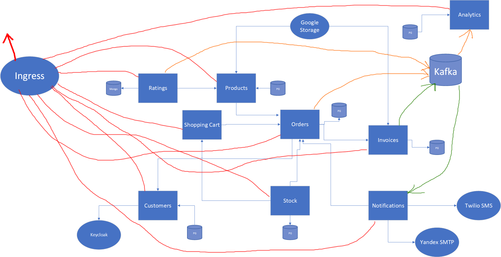

# Docs

## Conventions

### When creating new project
* groupId: si.rso.[short-name]
* artifactId: [repository-name]
* version: 1.0.0-SNAPSHOT
* parentVersion: ${project.version}

_Examples:_
* _Products service: si.rso.products:products-service_
* _Shopping cart: si.rso.cart:shopping-cart-service_

### Persistence module

All persistent entities must extend from BaseEntity class and must be named [NAME]Entity (e.g. CustomerEntity)

### Library module

All exposed entities (DTOs) must extend from BaseType and must be named without suffixes. (e.g. Customer)

### Services module

Each service must have interface defined in _services_ package and its implementation in _impl_ package

## Authentication

Url: `https://keycloak.mjamsek.com/auth/admin/rso/console`

## Overall design

