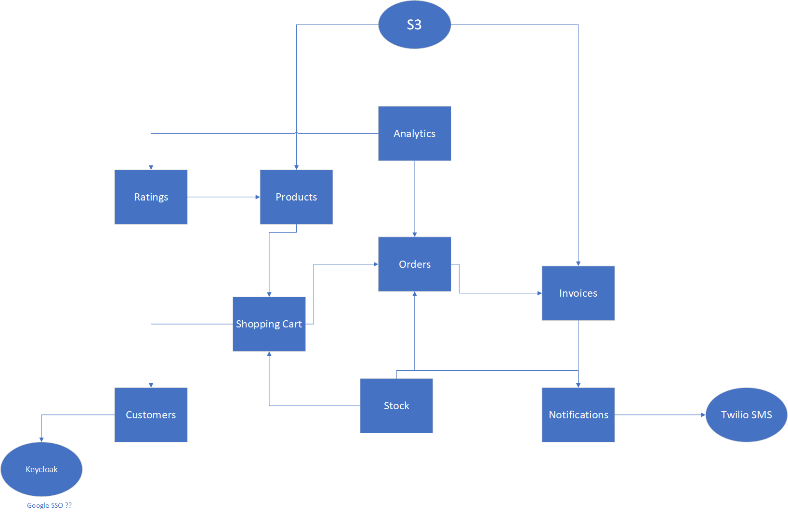

# Docs

## Conventions

### When creating new project
* groupId: si.rso.[short-name]
* artifactId: [repository-name]
* version: 1.0.0-SNAPSHOT
* parentVersion: ${project.version}

_Examples:_
* _Products service: si.rso.products:products-service_
* _Shopping cart: si.rso.cart:shopping-cart-service_

## Overall design

